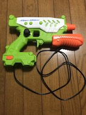
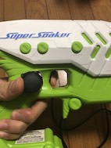

# 自主プロ作品 銃型コントローラ (ガンコン)

Arduino Leonardoを使ってヒューマンインターフェースデバイス(HID)を作りました

角加速度をマウスの移動量に変換して、ボタンスイッチをキーボードに割り当てています

参考にしたもの
- [MPU-9250_Breakout/MPU9250BasicAHRS.ino](https://github.com/sparkfun/MPU-9250_Breakout/blob/master/Libraries/Arduino/examples/MPU9250BasicAHRS/MPU9250BasicAHRS.ino)

includeしたもの
- [MPU9250.h](https://github.com/sparkfun/MPU-9250_Breakout/blob/master/Libraries/Arduino/src/MPU9250.h)
- [quaternionFilters.h](https://github.com/sparkfun/MPU-9250_Breakout/blob/master/Libraries/Arduino/src/quaternionFilters.h)
- Mouse.h
- Keyboard.h